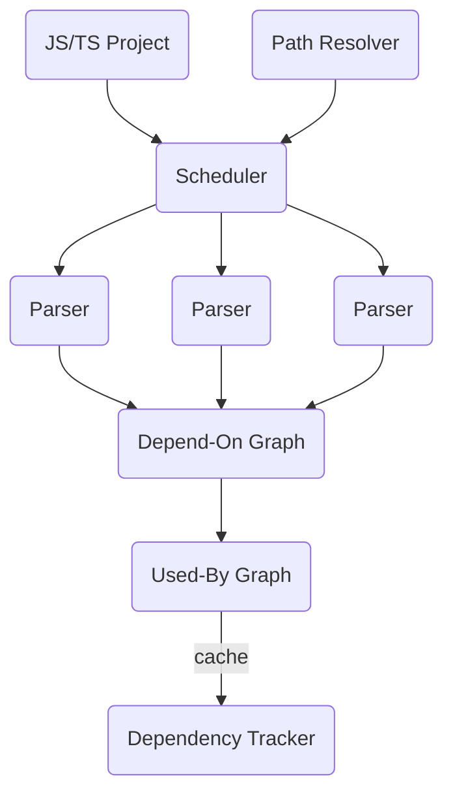

# Dependency Tracker

Dependency Tracker is a tool written in Rust for tracing the dependency of JavaScript(TypeScript)'s symbols across the module boundaries. It could be helpful when you're dealing with a large project and trying to make some changes like refactoring shared UI library, updating i18n translation keys.

[dependency-cruiser](https://github.com/sverweij/dependency-cruiser) is a good option tracking the module's dependency is enough for you. I myself will use `dependency-cruiser` in projects that are well-organized, since the module(packages)'s dependency is good enough. But instead, I hope you find `dependency-tracker` useful if you're looking for a more fine-grained dependency tracker.

This tool is currently used internally inside my own projects. So maybe some of the assumptions don't meet yours. Current assumptions are:

1. no invalid imports
2. no circular dependency
3. no string literal exports `export { myFunction as "my-function" };`
4. no string literal imports `import { "string name" as alias } from "module-name";`

# Overview

- `Path Resolver` resolves the import paths
- `Scheduler` manages the parsing order for modules
- `Parser`s extract imports, exports, symbols and determine their dependency
- `Depend-On Graph` aggregates all the parsed modules
- `Used-By Graph` reverses the edges from `Depend-on Graph`
- `Dependency Tracker` tracks the symbol by traversing the `Used-By Graph`

# Usage

I'm working on a CLI. But you can try it now by cloning this repository and run `cargo run`.
