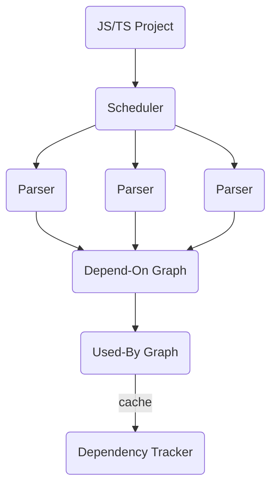

# Dependency Tracker

Dependency Tracker is a Rust-based tool designed to trace symbol dependencies in JavaScript and TypeScript across module boundaries. It's especially useful for large projects where tasks like refactoring a shared UI library or updating i18n translation keys can become complex and time-consuming.

If you're only interested in tracking module-level dependencies, you might prefer using [dependency-cruiser](https://github.com/sverweij/dependency-cruiser). I will also use it for projects that are well-organized, where understanding the relationships between modules (or packages) is enough. However, if you're looking for a tool with more fine-grained tracking at the symbol level, Dependency Tracker could be just what you need.

Currently, this tool is used internally in my own projects, so some assumptions may not align with your project needs. These assumptions include:

1. no invalid imports
2. no circular dependency
3. no string literal exports `export { myFunction as "my-function" };`
4. no string literal imports `import { "string name" as alias } from "module-name";`

## Problem Overview

Imagine an application with two routes: `/home` and `/account`.

Here's what the dependencies for the home page might look like:

And here's the account page:

This application can be represented as a Directed Acyclic Graph (DAG), where the edges represent dependencies between symbols. For example, `A -> B` means that `Symbol A` depends on `Symbol B`. In this context, symbols are module-scoped identifiers—for instance, given `const Foo = 'foo'`, `Foo` would be a symbol.

For the design team, the key question might be: **How many pages will be affected if we change this component?**

For the UX writing team, they might wonder: **How many pages will be affected if we update these translation keys?**

In smaller applications, these questions are easy to answer. But as the project grows, answering them becomes much more time-consuming.

By generating a DAG of all the symbols in your application, you can create a "super node" and use Dependency Tracker to trace all the dependent symbols (Adj+ from the super node). Then, if any symbol in the path is linked to a specific URL, you can collect those URLs and paths to map out the impact.

### Adj+ = { FriendList }

### Adj+ = { Avatar }

### Adj+ = { UserProfileHeader, FriendList }

### Adj+ = { Header, Avatar }

## Design Overview

- `Path Resolver` resolves the import paths
- `Scheduler` manages the parsing order for modules
- `Parser`s extract imports, exports, symbols and determine their dependency
- `Depend-On Graph` aggregates all the parsed modules
- `Used-By Graph` reverses the edges from `Depend-on Graph`
- `Dependency Tracker` tracks the symbol by traversing the `Used-By Graph`

## Demo

See the `demo` crate. You can run `cargo run --bin demo -- -s ./test-project/everybodyyyy -d ~/tmp`.

## Portable

See the `cli` crate. You can run `cargo run --bin cli -- -i <INPUT> -o <OUTPUT>`.
