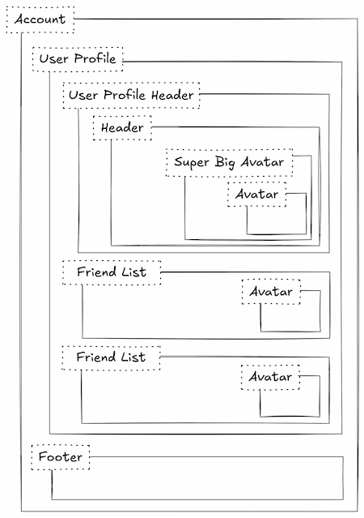
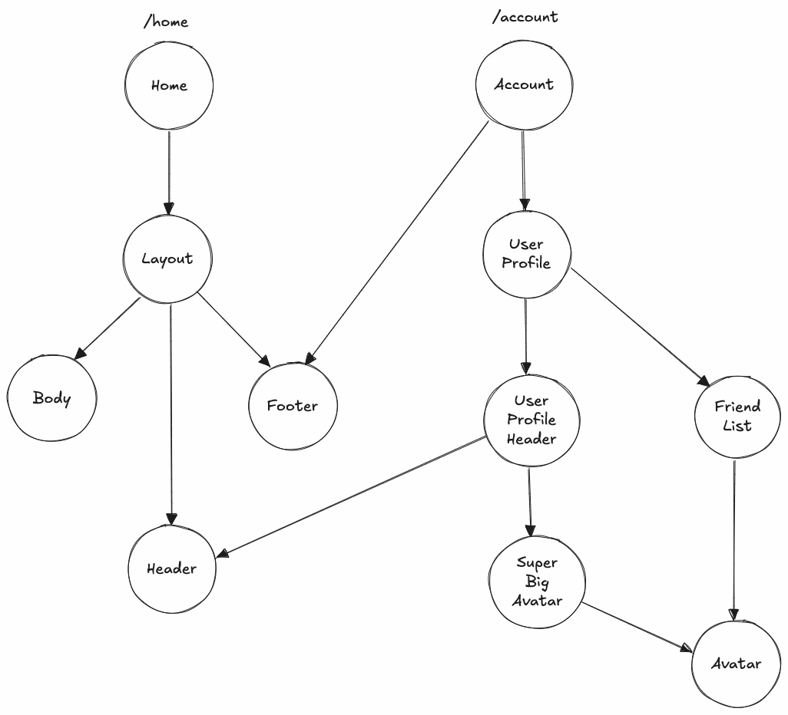
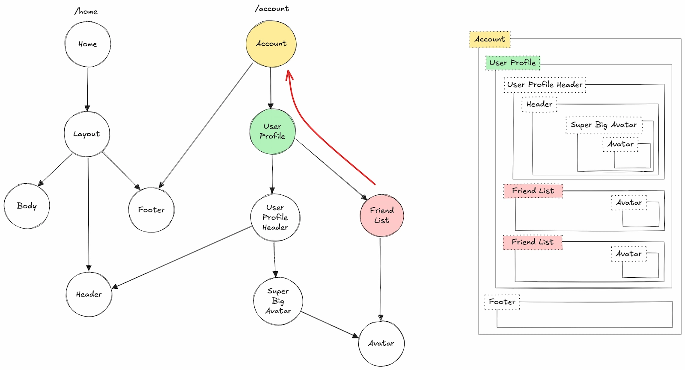
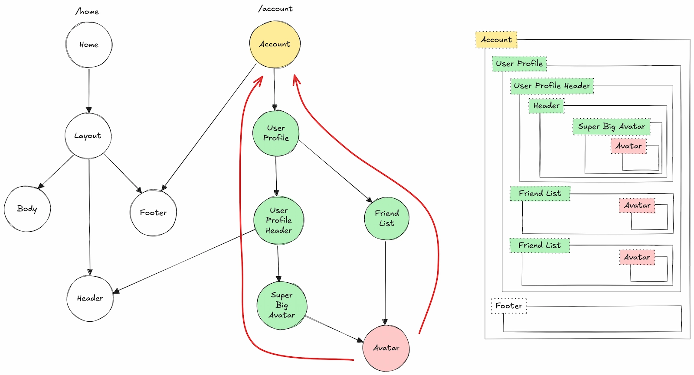
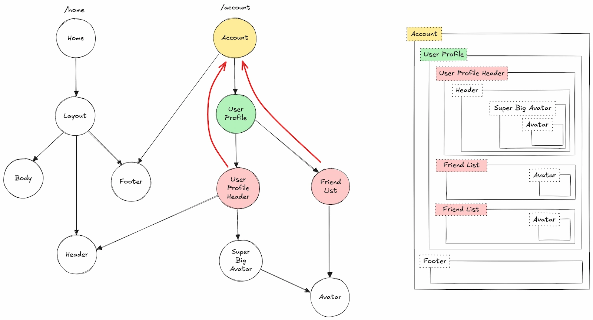
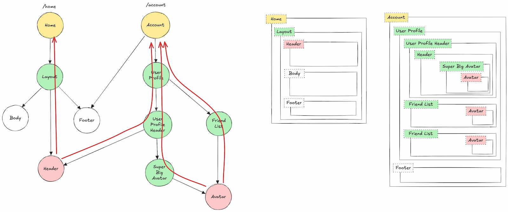
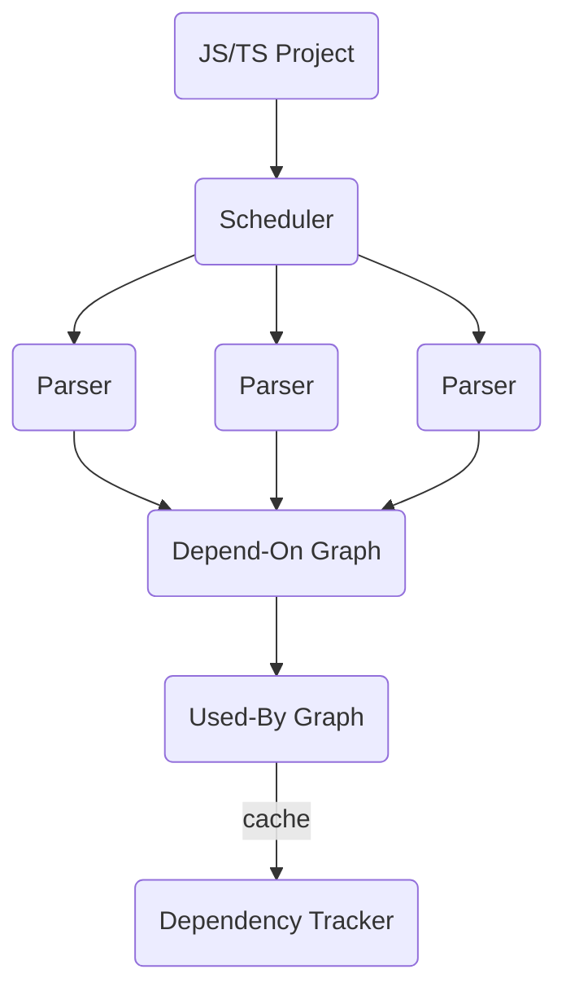
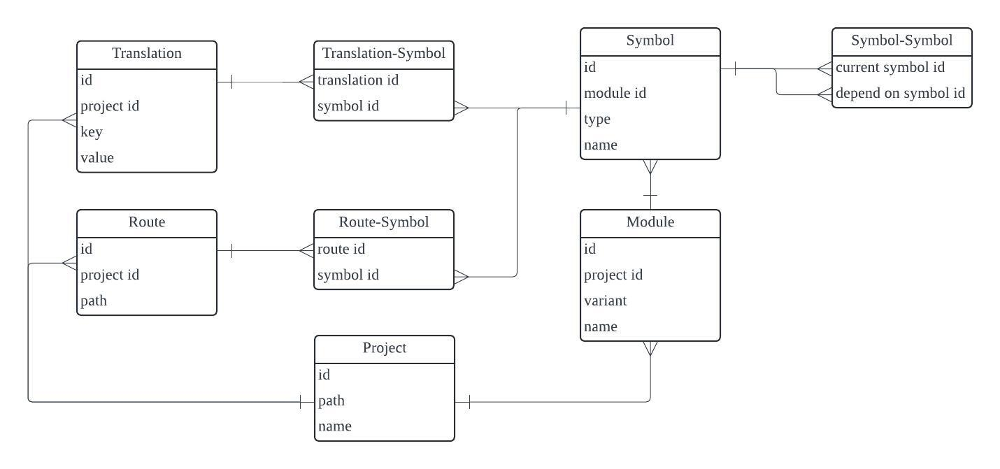

# Dependency Tracker

Dependency Tracker is a Rust-based tool designed to trace symbol dependencies in JavaScript and TypeScript across module boundaries. It's especially useful for large projects where tasks like refactoring a shared UI library or updating i18n translation keys can become complex and time-consuming.

If you're only interested in tracking module-level dependencies, you might prefer using [dependency-cruiser](https://github.com/sverweij/dependency-cruiser). I will also use it for projects that are well-organized, where understanding the relationships between modules (or packages) is enough. However, if you're looking for a tool with more fine-grained tracking at the symbol level, Dependency Tracker could be just what you need.

Currently, this tool is used internally in my own projects, so some assumptions may not align with your project needs. These assumptions include:

1. no invalid imports
2. no circular dependency
3. no string literal exports `export { myFunction as "my-function" };`
4. no string literal imports `import { "string name" as alias } from "module-name";`

## Design Decisions

### Choosing `Symbol` as a Vertex

A **symbol** can represent:

1. A module-level local variable
2. A named export
3. A default export

There is an **edge** from `v1` to `v2` if:

1. Both `v1` and `v2` are local variable symbols, and `v2` is lexically contained within `v1`
2. `v2` is imported from another module as `v1`
3. `v1` exports or re-exports `v2`

### Expanding Wildcard Imports and Re-Exports

Expanding wildcard import and re-export statements simplifies parallel module parsing. Without expansion, any module containing such a statement would need to be parsed first, creating a bottleneck. Additionally, it's common in JavaScript projects to have numerous index.js files dedicated to re-exports, making this approach even more important for efficient processing.

### Creating a Local Variable Symbol for Anonymous Default Exports

This decision involves a trade-off: either introduce a new rule for edges or create a local variable symbol with a unique, impossible-to-collide name for the anonymous default export.

### Depending on Namespace Imports Means Depending on All Named Exports

```js
import * as A from "a";

// B depends on all named export symbols from A, not just `A.b.c.d.e`
function B() {
  return A.b.c.d.e;
}
```

This presents a trade-off: either create a more fine-grained dependency graph or keep it simpler for now.

### Duplicating Local Variable Symbols for Exports or Default Exports

Duplicating local variable symbols when they are exported or re-exported as default will increase the size of the serialized output, but it avoids introducing new edge rules. This is another trade-off to consider.

## Problem Overview

Imagine an application with two routes: `/home` and `/account`.

Here's what the dependencies for the home page might look like:


And here's the account page:



This application can be represented as a Directed Acyclic Graph (DAG), where the edges represent dependencies between symbols. For example, `A -> B` means that `Symbol A` depends on `Symbol B`. In this context, symbols are module-scoped identifiers—for instance, given `const Foo = 'foo'`, `Foo` would be a symbol.



For the design team, the key question might be: **How many pages will be affected if we change this component?**

For the UX writing team, they might wonder: **How many pages will be affected if we update these translation keys?**

In smaller applications, these questions are easy to answer. But as the project grows, answering them becomes much more time-consuming.

By generating a DAG of all the symbols in your application, you can create a "super node" and use Dependency Tracker to trace all the dependent symbols (Adj+ from the super node). Then, if any symbol in the path is linked to a specific URL, you can collect those URLs and paths to map out the impact.

### Adj+ = { FriendList }



### Adj+ = { Avatar }



### Adj+ = { UserProfileHeader, FriendList }



### Adj+ = { Header, Avatar }



## Design Overview



- `Path Resolver` resolves the import paths
- `Scheduler` manages the parsing order for modules
- `Parser`s extract imports, exports, symbols and determine their dependency
- `Depend-On Graph` aggregates all the parsed modules
- `Used-By Graph` reverses the edges from `Depend-on Graph`
- `Dependency Tracker` tracks the symbol by traversing the `Used-By Graph`

## Libraries

### Core

reexport all the library crates:

- database
- graph
- i18n
- parser
- path_resolver
- portable
- route
- scheduler
- tracker

### Database

`Database` defines the models using in the `cli` and `api_server` crate.



### Graph

`DependOnGraph` takes the `SymbolDependency` one by one to construct a DAG. You have to add the `SymbolDependency` by topological order so that `DependOnGraph` can handle the wildcard import and export for you.

```rs
let mut depend_on_graph = DependOnGraph::new("<project_root>");
depend_on_graph.add_symbol_dependency(symbol_dependency_1).unwrap();
depend_on_graph.add_symbol_dependency(symbol_dependency_2).unwrap();
```

`UsedByGraph` takes a `DependOnGraph` instance and reverse the edges. `UsedByGraph` is serializable so you can construct once and distribute it to other users, it also useful if you want to have multiple `UsedByGraph` for different versions of your applications.

```rs
let used_by_graph = UsedByGraph::from(&depend_on_graph);

let serialized = used_by_graph.export().unwrap();
let used_by_graph = UsedByGraph::import(serialized).unwrap();
```

### I18n

⚠️ Please check the tests in this crate to check if it is suitable for your projects.

`collect_all_translation_usage` takes the project root and output the usage of i18n keys.

```rs
let i18n_usages = collect_all_translation_usage("<project_root>").unwrap();
```

### Parser

`Parser` provides two ways to construct the AST.

```rs
let module_ast_from_path = Input::Path("<module_path>").get_module_ast().unwrap();
let module_ast_from_input = Input::Code("<inline_code>").get_module_ast().unwrap();
```

### Path Resolver

`PathResolver` provides a very simple `resolve_path()` to resolve the import path based on this order:

- `<import_src>/index.js`
- `<import_src>/index.ts`
- `<import_src>.ts`
- `<import_src>.tsx`
- `<import_src>.js`
- `<import_src>.jsx`

```rs
let path_resolver = PathResolver::new("<project_root>");
let import_module_path = path_resolver.resolve_path("<current_module_path>", "<import_src>").unwrap();
```

### Portable

`Portable` defines the structure of the portable files.

```rs
let portable = Portable::new(
    project_root,
    i18n_to_symbol,
    symbol_to_route,
    used_by_graph
);
let serialized = portable.export().unwrap();
let portable = Portable::import(serialized).unwrap();
```

### Route

`Route` gives you the relationship between routes and symbols.

```rs
let mut symbol_to_routes = SymbolToRoutes::new();
symbol_to_routes
    .collect_route_dependency(&module_ast, &symbol_dependency)
    .unwrap();
```

### Scheduler

`Scheduler` gives you the module path by topological order. It will check the wildcard exports and namespace imports. If A does wildcard exports or namespace imports from B, then B will be returned before A.

```rs
let mut scheduler = ParserCandidateScheduler::new("<project_root>");
loop {
    match scheduler.get_one_candidate() {
        Some(module_path) => {
            // parse this module and add it into the depend-on graph
            scheduler.mark_candidate_as_parsed(module_path);
        }
        None => break,
    }
}
```

### Tracker

`DependencyTracker` traces all the symbol dependency paths for you.

```rs
let mut dt = DependencyTracker::new(&used_by_graph, false);
// trace the default export of this module
let paths = dt.trace("<module_path>", TraceTarget::DefaultExport).unwrap();
// trace the named export of this module
let paths = dt.trace("<module_path>", TraceTarget::NamedExport("exported_name")).unwrap();
// trace the local variable of this module
let paths = dt.trace("<module_path>", TraceTarget::LocalVar("variable_name")).unwrap();
```

## Binaries

### Demo

See the `demo` crate.

```
Track fine-grained symbol dependency graph

Usage: demo -s <SRC> -d <DST>

Options:
  -s <SRC>       Path of project to trace
  -d <DST>       Path of the output folder
  -h, --help     Print help
  -V, --version  Print version
```

### CLI

See the `cli` crate.

```
Parse a project and serialize its output

Usage: cli <COMMAND>

Commands:
  portable  Parse and export the project in portable format
  database  Parse and export the project in database format
  help      Print this message or the help of the given subcommand(s)

Options:
  -h, --help     Print help
  -V, --version  Print version
```

Usage:

- `cli portable -i <INPUT> -t <TRANSLATION_PATH> -o <OUTPUT>`
- `cli database -i <INPUT> -t <TRANSLATION_PATH> -o <OUTPUT>`

### API Server

see the `api_server` crate. The database is the one generated by CLI with `database` command.

```
Start the server to provide search API

Usage: api_server --db <DB>

Options:
      --db <DB>  The path of your database
  -h, --help     Print help
  -V, --version  Print version
```

## Client

You have to run the `api_server` with one of your portable, then you can use the web for searching.

This feature is made for non-technical folks 💆‍♀️.
